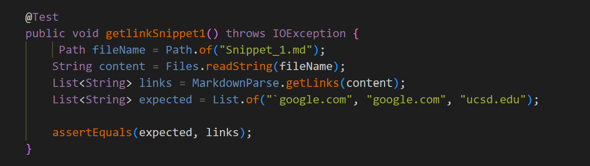
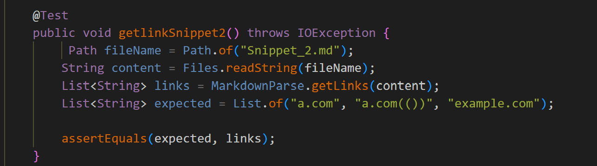
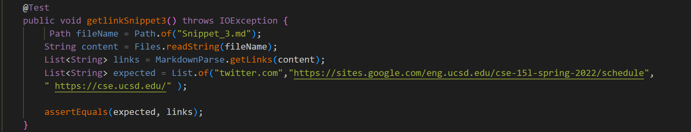
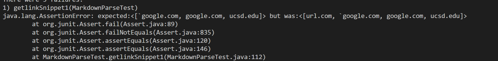
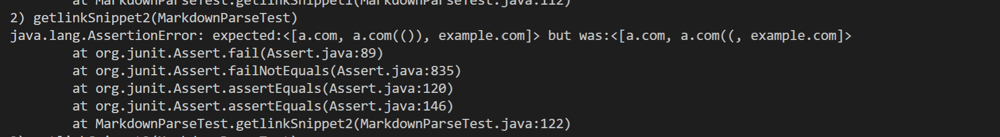
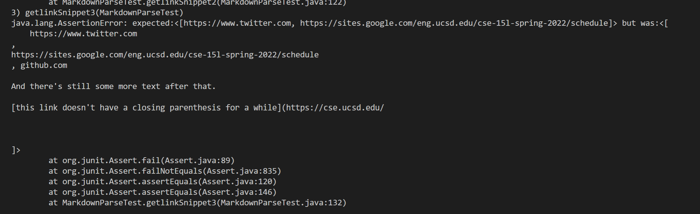
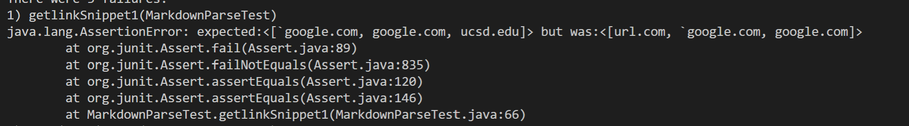
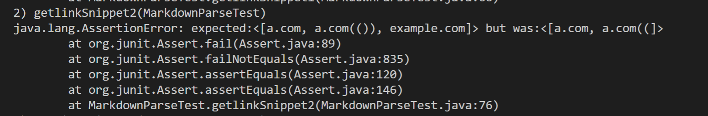

# Ali's CSE 15L Lab Report
## Debugging

### **Motivation**
This Blog Post is served to deal with debugging and dealing with very heavy edge cases. This Blog Post will revolve around testing two MarkdownParser files; their links are attached below

(1) [Our group's MDParser](https://github.com/21KennethTran/markdown-parser.git)  
(2) [Reviewed MDParser](https://github.com/leahkuruvila/markdown-parser)

The following tests are used to detrmine the success/failure of each snippet/test case (there are 3)

  

  
---
### **Debugging Our Group's MDParser**  

#### Snippet_1
``[`google.com, google.com, ucsd.edu] `` is the expected result when testing the snippet as per the previewd version of the file:

Such a test failure arised from the fact that ``"`"`` was considered as a negligble character and therefore considered ``url.com`` as a valid link ignoring the significance of ``"`"`` in the Markdown syntax.  
  
  By considering the significance of backticks present outside the links , we can create an if-statement such that it considers such cases and excludes them.
  A possible solution:
> if (markdown.indexOf("`", currentIndex) == markdown.indexOf("[", currentIndex)-1 )  
{   
    currentIndex+=2;  
    continue;  
    }  

#### Snippet_2
``[a.com, a.com(()), example.com]`` is the expected result when testing the snippet as per the previewed version of the file:

Such a test failure arised from the fact that the program caught the first`)` and ignored the rest of the line taking `a.com(())` as `a.com((`  
  
By taking the presence of the parentheses in multitudes, we can create a method that finds the lasr closed parentheses; however, this would involve more than 10 lines of code; a prominent example would be:
> static int findCloseParen(String markdown, int openParen)   
{  
int closeParen = openParen + 1;  
int openParenCount = 1;  
int lastCloseParenIndex = markdown.indexOf(")", openParen);  
 while (openParenCount > 0) {  
if (markdown.charAt(closeParen) == '(')  
 {  
     openParenCount++;  
} else if (markdown.charAt(closeParen) == ')')   
{  
 openParenCount--;  
lastCloseParenIndex = closeParen;  
 }  
closeParen++;  
}  
return lastCloseParenIndex;    
}
  
#### Snippet_3
``[twitter.com,https://sites.google.com/eng.ucsd.edu/cse-15l-spring-2022/schedule, https://cse.ucsd.edu/ ]`` is the expected result when testing the snippet as per the previewed version of the file:

Such a test failure arised from the fact that `(github.com` had a lot of text between it and and `)` therefore it encapsulated all the text considering it as a link.  
  
Such a problem can be addressed by considering the presence of empty characters between the 2 parentheses such that the presence of one would invalidate the link as being a link
This can be addressed by:
> if (markdown.indexOf(" ", openParen) != -1)  
{  
    continue;  
}
---
### **Debugging the Other Group's MDParser**  

#### Snippet_1
``[`google.com, google.com, ucsd.edu] `` is the expected result when testing the snippet as per the previewd version of the file:

Such a test failure arised from the fact that ``"`"`` was considered as a negligble character and therefore considered ``url.com`` as a valid link ignoring the significance of ``"`"`` in the Markdown syntax.  
  
  By considering the significance of backticks present outside the links , we can create an if-statement such that it considers such cases and excludes them.
  A possible solution:
> if (markdown.indexOf("`", currentIndex) == markdown.indexOf("[", currentIndex)-1 )  
{   
    currentIndex+=2;  
    continue;  
    }    

#### Snippet_2
``[a.com, a.com(()), example.com]`` is the expected result when testing the snippet as per the previewed version of the file:

Such a test failure arised from the fact that the program caught the first`)` and ignored the rest of the line taking `a.com(())` as `a.com((`  
  
By taking the presence of the parentheses in multitudes, we can create a method that finds the lasr closed parentheses; however, this would involve more than 10 lines of code; a prominent example would be:
> static int findCloseParen(String markdown, int openParen)   
{  
int closeParen = openParen + 1;  
int openParenCount = 1;  
int lastCloseParenIndex = markdown.indexOf(")", openParen);  
 while (openParenCount > 0) {  
if (markdown.charAt(closeParen) == '(')  
 {  
     openParenCount++;  
} else if (markdown.charAt(closeParen) == ')')   
{  
 openParenCount--;  
lastCloseParenIndex = closeParen;  
 }  
closeParen++;  
}  
return lastCloseParenIndex;   
}

#### Snippet_3
``[`google.com, google.com, ucsd.edu] `` is the expected result when testing the snippet as per the previewd version of the file:  
The test passes as it ignores the spaces done between the parentheses.
No further changes for this test is required.  

---
### **Wrap up**
This is the end of the blog post; I hope you foundit useful. **Happy Coding!**